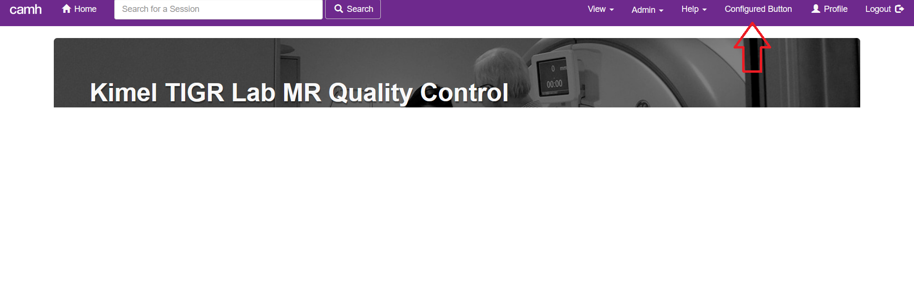

.. _menu-config:

------------------
Menu Configuration
------------------

New items can be added to several of the dashboard's menus. This page describes
how to construct or edit a configuration file to use this feature.

Once your file has been created you can get the dashboard to read it by
setting the environment variable ``DASH_MENU_CONFIG`` to the full path to your
file.

.. note::
    The dashboard must be restarted when this configuration is added or changed
    or new menu items will not appear.

File Format
***********
The configuration file must be yaml format. Each button you want to add must
have its own entry in the file. Below is an example of a correctly formatted
file with two buttons, and an explanation of all required and optional fields
that may be used.

Example
^^^^^^^
.. code-block:: yaml

    # Adds a button to the main navigation menu
    my_nav_menu_btn:
        menu: "nav_menu"
        btn_text: "About Us"
        url: "https://google.ca"

    # Adds a button to the timepoint menu
    my_tp_menu_btn:
        menu: "timepoint"
        btn_text: "Report Error"
        url: "https://google.ca"

Required Fields
^^^^^^^^^^^^^^^
* **menu**

  * Description: Specifies the menu that the button should be added to.
  * Accepted Values: timepoint, nav_menu, help

* **btn_text**

  * Description: The text to display on the button. HTML entered here
    will NOT be rendered.

* **url**

  * Description: The URL that the button should point to (i.e. the href value
    for the button).

Optional Fields
^^^^^^^^^^^^^^^
* **hover_text**

  * Description: The text to display when users hover over the button.

Menu Types
**********

timepoint
^^^^^^^^^
Adds a button to the menu on the upper right of the main timepoint page, as
shown below.

.. image:: imgs/timepoint_menu_config.png

nav_menu
^^^^^^^^
Adds a button to the main navigational menu, which always displays at the
top of the dashboard, as shown below.

help
^^^^
Adds a button to the help drop down menu on the main navigational menu, as
shown below.

.. image:: imgs/help_menu_config.png
